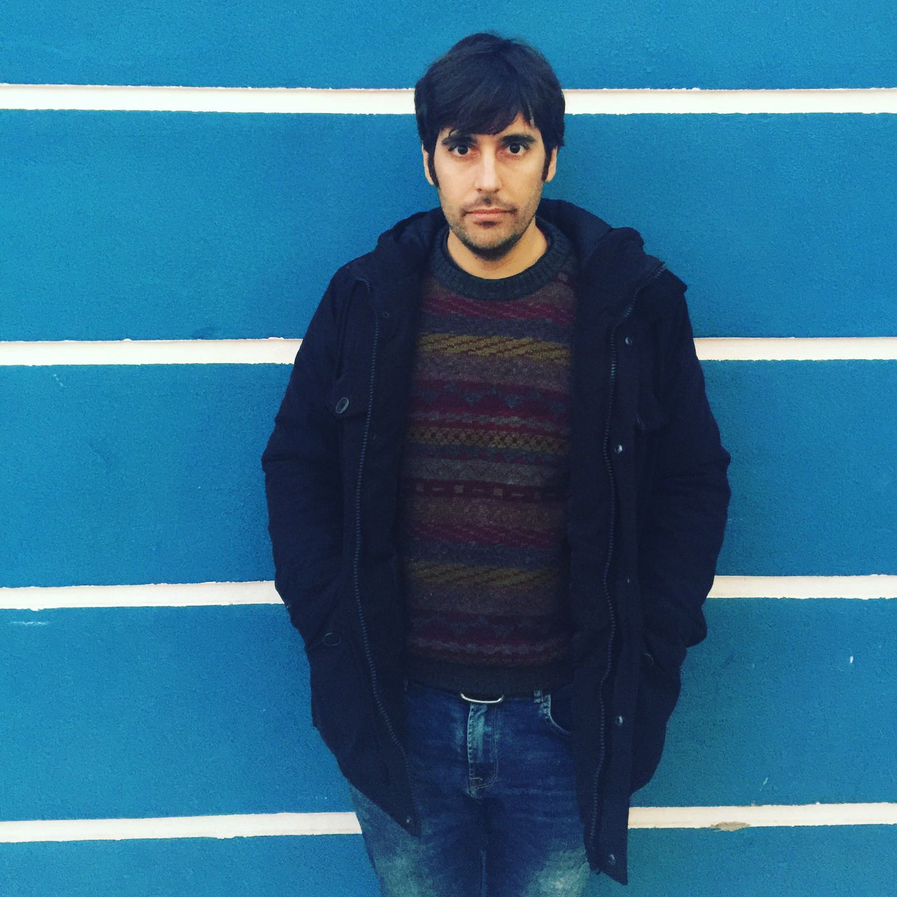

Title: itulo about
Slug: about
Date: 2013-02-23 09:42

<h3>My name is Pablo and I make stuff.</h3>

As a geographer and software developer, I'm intereseted in GIS, Cartography, Data Visualization as well other topics like geopolitics or free software. 

After graduate in geography I specialized in GIS and geomatics, working in GIS industry and
then I decided to follow my career as software developer, thing that has allowed me to improve my programming skills in geospatial analysis, plugin developement and spatial database implementation. I've also learnt how to develop in technologies like Python, Java, Processing, even I've coded in .NET!

I combine my work as a GIS developer with teaching in Geoinnova Formacion as QGIS tutor.

I like free software like QGIS, Postgres, PostGIS, Python, Ubuntu, Processing or even duino. 

I'm Ubuntu user since 2007 

I like long SQL queries and hate regular expressions. 

I also hate recursive functions, and have never used gotos :) 

I used MySQL spatial once. 

I ride an old road bike and try to surf in the mediterranean.

I had a laptop full of stickers, but now I dare not put them on my Macbook.

I like broccoli.

